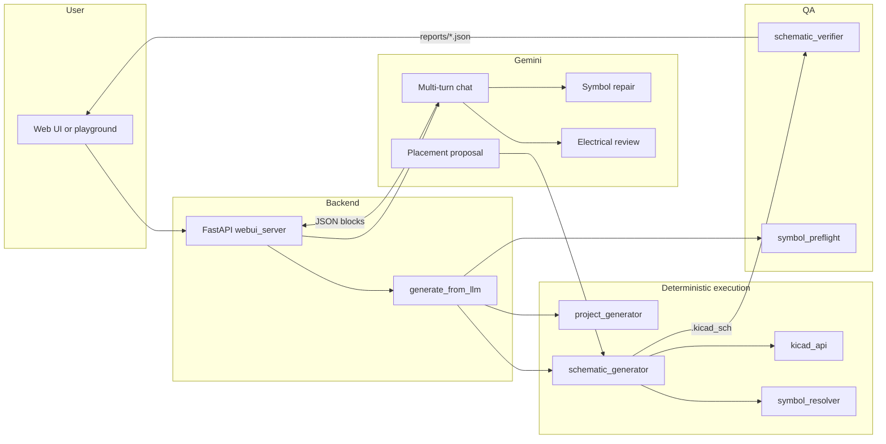

# ECE 499 Project Report — Front Matter and Introduction

*Draft for ECE 499 submission. System name: **SchematIQ**. Code and paths may reference `Code/` in the repository.*

---

## Title Page

<div align="center">

<br/><br/>

# SchematIQ: AI-Assisted PCB Schematic Generation Using Large Language Models

<br/><br/>

**ECE 499 Project Report**

Winter 2026

University of Waterloo

<br/><br/>

**[Author Name]**  
*[Program, e.g., Computer Engineering / Electrical Engineering]*

**Supervisor:** [Supervisor Name]

**Date:** April 2026

<br/><br/>

</div>

*When converting to Word or LaTeX, replace bracketed fields and center the title block on its own page.*

---

## Abstract

PCB design starts with schematic capture: encoding connectivity and hierarchy in an electronic design automation (EDA) tool. That step is slow and expertise-heavy—libraries, pin naming, and tool-specific file formats must align before layout can begin. **SchematIQ** is a research prototype that asks whether a large language model (LLM) can help turn natural-language descriptions into editable **KiCad** schematics in a way that supports **rigorous evaluation**, not only informal demos.

The system uses **structured JSON** as an intermediate representation so the model need not emit raw KiCad syntax. A **deterministic Python backend** resolves symbols from a curated database and local KiCad libraries, places and wires components, and writes **S-expression** schematics—reducing format errors and grounding parts against known libraries. **Google Gemini** drives multi-turn assistance, constrained JSON, optional placement help, **symbol repair** for invalid parts, and **electrical review**. A **round-trip verifier** parses `.kicad_sch` files, builds a connectivity graph, and compares it to the JSON—objective pass/fail feedback in the spirit of design-time assertions.

The pipeline supports **multi-sheet** hierarchies and a **web UI** (FastAPI, React). Evaluation combines **tool-backed checks** (validity, preflight, verifier metrics such as missing nets and pin mismatches) with qualitative case studies over systematic prompts spanning simple analog blocks, power regulators, connectors, and sensor-centric boards. Framed against literature on LLM limits in PCB tasks and constraint-guided schematic generation, the results suggest that separating **LLM reasoning** from **deterministic execution and verification** yields **chat-to-KiCad** workflows with reportable fidelity, while **systematic KiCad ERC/DRC** campaigns and expanded benchmarks are clear next steps.

*Abstract: ~250 words (trim for a strict departmental cap if required).*

---

## Table of Contents

**Front matter**

- [Title Page](#title-page)
- [Abstract](#abstract)
- [Table of Contents](#table-of-contents)
- [List of Figures](#list-of-figures)
- [List of Tables](#list-of-tables)

**Main body**

1. [Introduction](#1-introduction)  
   1.1 [Motivation](#11-motivation)  
   1.2 [Problem Statement](#12-problem-statement)  
   1.3 [Project Evolution](#13-project-evolution)  
   1.4 [Objectives](#14-objectives)  
   1.5 [Report Organization](#15-report-organization)  
2. [Background and Related Work](#2-background-and-related-work)  
   2.1 [KiCad Schematic Representation](#21-kicad-schematic-representation)  
   2.2 [Large Language Models in EDA](#22-large-language-models-in-eda)  
   2.3 [Constraint-Guided and Knowledge-Based Generation](#23-constraint-guided-and-knowledge-based-generation)  
   2.4 [Evaluation Methodology in the Literature](#24-evaluation-methodology-in-the-literature)  
   2.5 [Gap Analysis](#25-gap-analysis)  
3. [System Architecture](#3-system-architecture)  
4. [KiCad Schematic Generation Engine](#4-kicad-schematic-generation-engine)  
5. [LLM Integration](#5-llm-integration)  
6. [Web Interface](#6-web-interface)  
7. [Verification and Quality Assurance](#7-verification-and-quality-assurance)  
   7.3.1 [Schematic ERC: first manual runs](#731-schematic-erc-on-first-manual-runs-observed-categories-and-fixes)  
8. [Results and Evaluation](#8-results-and-evaluation)  
9. [Future Work](#9-future-work)  
10. [Conclusion](#10-conclusion)  
11. [References](#11-references)  
12. [Appendices](#12-appendices)  

*Page numbers: insert when typesetting (Word/LaTeX).*

---

## List of Figures

| Figure | Title |
| ------ | ----- |
| Fig. 1 | SchematIQ end-to-end pipeline (see §3; mermaid in source) |
| Fig. 2 | Web UI — chat and project workflow *(capture when typesetting)* |
| Fig. 3 | Web UI — generation / action panel *(capture when typesetting)* |

*Replace Fig. 2–3 with numbered figures and page numbers in the final PDF/Word export.*

---

## List of Tables

| Table | Title |
| ----- | ----- |
| Tab. 1 | Round-trip verifier reports — example sheets (§8) |
| Tab. 2 | Proposed evaluation metrics vs implementation status (§8) |

---

## 1. Introduction

### 1.1 Motivation

Electronic products depend on schematics as the authoritative description of how components interconnect before layout, fabrication, and test. Engineers spend substantial time selecting symbols that match real parts, reconciling pin names and numbers with datasheets, and maintaining consistency across hierarchical sheets and net names. Modern EDA tools such as **KiCad** are capable and open, but they still require the designer to carry detailed library and connectivity knowledge in working memory. Mistakes at the schematic stage—wrong pins, missing power nets, ambiguous grounds—propagate into costly layout iterations or silent electrical failures.

At the same time, **large language models** have improved at following structured specifications, carrying multi-turn context, and producing JSON or code that downstream tools can consume. For hardware, that raises a practical question: can natural language and iterative dialogue lower the friction of first-pass schematic capture, especially for proof-of-concept boards, education, and rapid exploration of alternatives? Answering that question responsibly requires more than anecdotal demos; it requires **clear success criteria**, **grounded part and symbol choices**, and **automated checks** that compare what the designer intended to what the tool actually wrote to disk.

### 1.2 Problem Statement

This project asks whether an LLM can **reliably** generate **valid, electrically coherent KiCad schematics** from natural language descriptions, when paired with a deterministic toolchain and verification layer. “Reliable” here is not claimed in absolute terms; it is operationalized through **structured outputs**, **library grounding**, **round-trip comparison** between intent (JSON) and generated schematics, and **reported metrics** (for example, verifier outcomes and known failure modes). The central research tension is familiar from recent work on LLMs in PCB and circuit tasks: models can produce **plausible** explanations and topologies while still erring on details that EDA tools enforce strictly—pin identifiers, voltage domains, and nonexistent manufacturer part numbers.

SchematIQ therefore treats the LLM primarily as a source of **connectivity and design decisions** expressed in a constrained intermediate representation, while **Python components** handle KiCad syntax, symbol embedding, placement, wiring, and parsing back for verification—an explicit split between **reasoning** and **execution** emphasized in the project’s supervisory framing.

### 1.3 Project Evolution

The work began with a broader **SchematIQ** (formerly ChipChat) concept oriented toward an interactive design assistant. Early supervision steered the effort toward **research-grade evaluation**: defining how success is measured, aligning metrics with literature on LLM limitations in hardware tasks, and documenting edge cases (over-constrained requests, large multi-sheet designs) rather than optimizing only for impressive single demos. The implementation trajectory moved from hand-authored JSON and core **KiCad** generation (component database, hierarchical sheets, schematic generator) toward **Gemini API** integration, strict schema discipline, symbol resolution and repair, a **web UI**, and **round-trip verification**. A originally envisioned **multi-model comparison** phase was partially explored qualitatively; the implemented pipeline standardized on **Gemini 2.5 Flash** for cost and latency while keeping the architecture modular enough to revisit broader model studies in future work.

### 1.4 Objectives

The project pursued the following objectives:

1. **Structured JSON for circuit intent** — Define and use a hybrid schema (per-component connections and sheet-level nets where appropriate) that captures multi-sheet structure while managing redundancy and drift between representations.

2. **Deterministic KiCad generation and symbol resolution** — Implement robust mapping from JSON to KiCad **S-expressions**, including pin matching with aliases, automatic handling of ground and shield pins, hierarchical **`.kicad_pro`** projects, and resolution across custom and vendored symbol libraries.

3. **Gemini-based multi-turn design assistant** — Provide conversational refinement, command-driven actions (generate, check, validate, repair, review), and incremental ingestion of model output into project state.

4. **Validation, repair, review, and round-trip checking** — Integrate symbol preflight, LLM-assisted symbol repair and electrical review, and a verifier that reconstructs connectivity from saved schematics to detect missing or incorrect nets and pin associations.

Together, these objectives support an end-to-end **prompt → JSON → KiCad** workflow suitable for systematic evaluation and honest reporting of limitations.

### 1.5 Report Organization

The remainder of this report is organized as follows. **Background and Related Work** summarizes the KiCad schematic model, LLM roles and failure modes in EDA, constraint- and knowledge-graph-oriented schematic generation, and evaluation methodologies from the literature, closing with a gap analysis relative to chat-only tools. **System Architecture** presents the full pipeline from user input through the web backend, LLM, JSON intermediate representation, and generators to on-disk projects, including the component database and library strategy.

**KiCad Schematic Generation Engine** details the low-level KiCad API, project and sheet generators, pin-matching and wiring logic, and symbol resolution. **LLM Integration** covers system prompting, multi-turn state management, optional placement assistance, symbol repair, and electrical review. The **Web Interface** chapter describes the FastAPI server and React client. **Verification and Quality Assurance** explains the philosophy of objective checks, the round-trip verifier’s graph-based comparison, integration into batch generation, and the relationship to KiCad ERC/DRC alongside representative bugs addressed during development.

**Results and Evaluation** reports systematic prompt sets, quantitative verifier fields where available, LLM behavior (schema adherence, hallucinated symbols, repair), and limitations. **Future Work** outlines recursive repair from verifier diffs, stronger tool-backed metrics, improved placement, alternative IR versus direct S-expression emission, and layout-oriented extensions. **Conclusion** synthesizes contributions and lessons. **References** and **Appendices** provide citations and abbreviated artifacts (JSON excerpts, schematic fragments, verifier reports, prompt snippets).

---

## 2. Background and Related Work

### 2.1 KiCad Schematic Representation

KiCad stores schematics as **textual S-expression** files (`.kicad_sch`). A sheet lists **placed symbol instances** (each referencing a `lib_id`), **wires** as line segments between grid-snapped points, **labels** and **hierarchical labels** that name nets, and an embedded **`lib_symbols`** section containing the definitions needed for that sheet to be self-contained. Hierarchical design uses a **root sheet** with **sheet boxes** that point to child `.kicad_sch` files; the project is tied together by a **`.kicad_pro`** file listing sheet order and metadata.

Symbols live in **`.kicad_sym`** libraries. Custom flows often use **one symbol per file**; the official KiCad libraries ship as **packed** files containing many `(symbol "Name" ...)` definitions. Sub-symbols (e.g. `NE555D_0_1`) nest inside parents. KiCad 9 and KiCad 10 differ slightly in supported fields; SchematIQ’s embedder **strips KiCad-10-only** constructs when targeting KiCad 9 for compatibility. Connectivity in the editor is **geometric**: ERC reasons about endpoints on the connection grid, not about an abstract SPICE netlist until export—so any generator must place wires and labels so that intended nets are **physically continuous** on the sheet.

### 2.2 Large Language Models in EDA

LLMs are strong at **natural-language reasoning**, **datasheet-style narratives**, and **structured output** when constrained by schemas and examples. For hardware, they also exhibit recurring failure modes: **hallucinated manufacturer part numbers**, **plausible but incorrect topology**, and **mismatch between pin names in text and pin numbers in symbols**. Recent benchmarks highlight **spatial and constraint reasoning** as weak points for generative models on PCB tasks—for example, **PCB-Bench** evaluates LLMs on placement, routing, and design-rule-style questions and finds substantial gaps versus expert performance [1]. That motivates **offloading spatial layout and tool syntax** to deterministic code while the model focuses on **connectivity intent** and **part selection**—an agent-style split echoed in work that separates high-level decisions from tool execution [5].

The **CIRCUIT** line of work emphasizes **topology-level** reasoning and evaluation in a **unit-test** style, reporting high failure rates even when model explanations sound credible [2]—underscoring the need for **automatic verification** rather than prose-only review.

### 2.3 Constraint-Guided and Knowledge-Based Generation

**PCBSchemaGen**-style systems argue for **explicit constraints**, **knowledge graphs**, and **libraries** so that generated designs remain tied to **realizable parts and design rules** [3]. SchematIQ aligns with that direction through a **curated component database** (`component_database/components.json`) injected into prompts: entries include **symbol paths**, **pin lists**, **voltage ranges**, and **interfaces**, steering the model toward grounded part choices. The JSON intermediate representation acts as a **lightweight IR** between chat and KiCad, similar in spirit to separating **intent** from **geometry** in constraint-based CAD pipelines.

### 2.4 Evaluation Methodology in the Literature

Hardware-design papers increasingly rely on **tool-backed checks** rather than human preference alone. **EngDesign**-style evaluation uses **simulation and ERC-like** signals where available [4]. Layout-centric work such as **AEM-PCB** proposes **aesthetic and readability metrics** for boards [6], which maps to **future** quantitative scoring for schematic placement in SchematIQ (currently **algorithmic grid** plus optional **LLM-assisted** coordinates). Section 8 summarizes which **metric rows** from the project plan are **implemented** (JSON validity, symbol preflight, round-trip verifier), **partial** (ERC as a goal), or **future** (AEM-style placement scores, full DRC campaigns).

### 2.5 Gap Analysis

**Chat-only assistants** can discuss circuits but rarely emit **editable KiCad projects** with **local library grounding** and **repeatable fidelity checks**. **Commercial EDA** assumes a human in the loop for capture. SchematIQ targets the gap: **multi-turn natural language → constrained JSON → deterministic KiCad generation → parse-back verification**, with optional **LLM repair and electrical review**. The approach trades **full automation** (no human review) for **traceability**: the same JSON can be regenerated, diffed, and compared to the schematic the tool wrote.

---

## 3. System Architecture

### 3.1 End-to-end pipeline

Figure 1 summarizes the architecture. The **LLM** produces **design JSON** (and optional placement JSON); **Python modules** resolve symbols, embed libraries, place and wire, and write **S-expressions**. **Verification** parses `.kicad_sch` and compares connectivity to the JSON. **Repair** and **review** loops call the LLM again with smaller, structured prompts.



**Reasoning vs execution:** The model outputs **connectivity intent** (nets, pin associations, sheet structure). The backend enforces **KiCad’s concrete syntax**, **grid snapping**, **symbol embedding**, and **pin geometry**—the split emphasized in project supervision (Jan 30 notes): **LLM = reasoning / decisions**; **Python = execution / format / placement**.

### 3.2 Component database

`component_database/components.json` is the **master parts list** for prompting and grounding. Each part entry includes **identity** (name, MPN, description), **electrical** metadata (e.g. voltage range), **symbol** (`library` path, `lib_id`), optional **footprint**, and a structured **`pins`** array (number, name, type, function). At prompt time, relevant entries (or the full DB, depending on script configuration) are injected so the model is nudged toward **symbols that exist** under `KICAD_Library/`. New parts discovered in chat can be accumulated into **`data/llm_components.json`** for later promotion into the master DB.

### 3.3 JSON schema (project IR)

The project JSON carries:

- **`project_name`**, **`description`**
- **`sheets`**: ordered list of `{ name, file, page }` for hierarchy
- **`components`**: active parts per sheet (`ref`, `part`, `sheet`, `connections[]` with `pin`, `net`, optional `pin_name`)
- **`passives`**: `R`, `C`, `L`, `D`, etc., with `type`, `value`, `sheet`, `connections`
- **`nets`**: sheet-local or cross-sheet net records as emitted by the model

This is a **hybrid** of “per-component connections” (Approach A) and explicit **net lists** (Approach B) from the Feb 17 design note: **connections** drive the generator directly, while **`nets`** help cross-sheet consistency and review. The trade-off is **redundancy and drift** if the two views disagree—mitigated by **ingest rules** that replace sheet-local state on redesign (see §5.2) and by **verification** against the schematic actually generated.

### 3.4 KiCad symbol library strategy

- **Custom symbols**: `KICAD_Library/Symbols/` — single-file or project-specific parts (e.g. BME280, MCP2221A, regulators).
- **Vendored official libraries**: `KICAD_Library/kicad-symbols/` — packed Device, Connector_Generic, Regulator_*, MCU_*, etc.
- **Resolution** (`symbol_resolver.py`): index **custom** `.kicad_sym` stems and **packed** top-level symbol names; match **exact**, **prefix**, then **fuzzy** heuristics with **minimum symbol length** and **pin-count** guards to avoid absurd matches (e.g. single-letter collisions).
- **Aliases**: `Code/config/symbol_aliases.json` plus `symbol_aliases.py` normalize LLM strings before lookup.

Generated projects may include **`sym-lib-table`** and **`_schematiq_embedded.kicad_sym`** where embedding is used for portability.

### 3.5 Secondary output: tscircuit

The same JSON can drive **`tscircuit_generator`** for a **TypeScript / web-preview** path (useful for rapid feedback). This track is **secondary** to KiCad; it shares intent but differs in **failure modes** and maturity (see §8 and §9).

---

## 4. KiCad Schematic Generation Engine

Core modules live under `Code/src/lib/`.

### 4.1 Low-level KiCad API (`kicad_api.py`)

Responsibilities include: initializing **schematic data structures** (version, UUID, paper, `lib_symbols`, `items`); **extracting** `(symbol ...)` blocks from single-file or **packed** libraries; **renaming** embedded symbol IDs to avoid collisions; **flattening** `(extends ...)` inheritance where required for KiCad 9; and **sanitizing** v10-only fields. The API builds the **S-expression text** that `schematic_generator` appends to—wires, labels, symbol instances, `PWR_FLAG`, and properties—while respecting the **math-Y** coordinate convention in symbol definitions vs schematic placement.

### 4.2 Project generator (`project_generator.py`)

`generate_root_schematic` reads the JSON **sheet list** and lays out **sheet boxes** on an A4 root in a **row-major grid** with configurable **box size** and **spacing**. It writes the root `.kicad_sch` and returns **UUIDs** for each sheet for use in **`.kicad_pro`**. `generate_project_file` emits the **project file** referencing child schematics and metadata so KiCad opens the hierarchy as a single project.

### 4.3 Sheet-level schematic generator (`schematic_generator.py`)

`generate_from_json` loads the project JSON, filters **components** and **passives** for the target **sheet**, embeds symbols via `kicad_api` and `symbol_resolver`, and adds **wires** and **labels**.

**Placement:** Passives follow a **deterministic grid** (columns and rows with snapping to **1.27 mm**). Main ICs use **baseline coordinates** with horizontal spacing when multiple large symbols appear. Optional **`placements`** from `schematic_placement_llm` override **positions and angles** while **wiring rules** remain deterministic.

**Pin matching** (priority sketch): (1) If JSON provides **pin number** and optional **pin_name**, prefer a symbol pin whose **number** matches and whose **name** is **compatible** with aliases; (2) else **name-based** matching with **`_PIN_NAME_ALIASES`** (e.g. VOUT↔VO, VIN↔VI) and **SWD**/connector heuristics; (3) numeric and **substring** fallbacks where safe. **Duplicate GND** pins on some sensors are handled by **disambiguation** logic in the connection loop.

**Ground and shield:** Pins whose names belong to **`_GND_PIN_NAMES`** (GND, VSS, EP, …) receive **automatic GND** attachment when appropriate; **SHIELD** aliases connect **USB**-style shields to the ground network.

**Passives:** `PASSIVE_CONFIG` maps **type** to custom symbols or **packed** `Device:R`, `Device:C`, `Device:D`, with **rotation** chosen so **horizontal** layouts align with pin geometry. Inline **fallback** definitions exist for **R/C/L** if files are missing.

### 4.4 Symbol resolution (`symbol_resolver.py`)

Builds a **lazy global index** of all **custom** and **packed** symbols. Resolution tries **exact** stem/name match, then **prefix** and **short-head** heuristics for tape-and-reel suffixes, with **pin-count** checks to reject **gross** mismatches. Returns paths suitable for **`embed_symbol_from_file`** or **`embed_symbol_from_packed_lib`**. Works with **`symbol_preflight`** and **`symbol_repair_llm`** when validation fails.

---

## 5. LLM Integration

The default model in code is **`gemini-2.5-flash`** (`prompt_playground.py`, `webui_server.py`).

### 5.1 System prompt engineering (`prompt_playground.py`)

The system prompt casts the model as an **electronics design assistant** with a **fixed workflow**: greet, elicit requirements, propose **multi-sheet** structure, then complete **per-sheet** JSON following a **checklist** (interfaces, power, decoupling, pin-level verification). It mandates **JSON code blocks** for machine ingestion and documents **commands** (`gen`, `check`, `validate`, `repair`, `review`). The **component database** path is loaded from the repo’s `component_database/components.json` and embedded into context so outputs use **realistic parts and pin names**. Iteration history (Mar 2026) showed that **loose JSON** early on forced **stricter schema descriptions** and **richer DB injection**—reducing parse failures and hallucinated structure.

Optional **Google Search** tooling can be enabled in the playground for **datasheet-aware** reasoning; trade-offs include **latency** and **non-determinism**.

### 5.2 Multi-turn design conversation

**CLI playground** (`prompt_playground.py`) and **web UI** (`webui_server.py`) maintain **session state**. The web server’s **`_ProjectState.ingest()`** merges model output:

- A block with **`project_name` + `sheets`** replaces **top-level** sheet list.
- A **`sheet_design`** block **clears** all **components, passives, and nets** for that sheet before appending new ones—fixing **stale passives** after a redesign (e.g. buck → LDO).
- **`cross_sheet_nets`** merges **hierarchical** nets without duplicating keys.

**Commands** map to actions: generate KiCad/tscircuit, **validate** symbols, **repair** with LLM assistance, **two-LLM review**, and **check** (preflight + review). The playground also uses a small **intent classifier** so natural phrasing like “run an ERC-style check” can trigger **`check`** without hard-coded keywords.

### 5.3 LLM-assisted placement (`schematic_placement_llm.py`)

`propose_placements` sends a **reduced JSON** (refs, sheets, parts, passive types, nets) to Gemini with **grid** and **A4 bounds** constraints; the model returns **`sheets[SheetName].symbols[ref] → {x, y, angle}`**. Coordinates are **snapped** to the KiCad grid. **`generate_from_llm.py`** applies this when **`--llm-place`** is set or **`SCHEMATIQ_LLM_PLACE`** is enabled, writing **`reports/*_placement.json`**. **Wiring** still uses the deterministic **stub + label** strategy in `schematic_generator.py`.

### 5.4 Symbol repair (`symbol_repair_llm.py`, `symbol_preflight.py`)

When **`part`** strings do not resolve to a local symbol, **`build_candidate_pool`** ranks **candidate symbol names** by **token overlap** and **reference class** heuristics (`_guess_library_categories`). The repair prompt asks the model to pick from the **candidate pool** only; answers are **re-validated** against the index—**no blind trust**. Deterministic **alias** and **fuzzy** resolution run **before** invoking repair.

### 5.5 Electrical review (`electrical_review_llm.py`)

**Two reviewers** share the same JSON but different instructions: **Reviewer A (structural)** emphasizes netlist structure and **obvious topology** issues; **Reviewer B (electrical)** emphasizes **levels**, **interfaces**, and **risk**. Both return **strict JSON** findings with **severity**; results are **merged** with **deterministic prechecks** (e.g. empty net names, **power-ish** nets). **`severity_meets_or_exceeds`** supports **gating** (`--review-fail-on`) before generation in **`generate_from_llm.py`**.

---

## 6. Web Interface

### 6.1 Backend (`scripts/webui_server.py`)

**FastAPI** application with **CORS** enabled for local development. **Lazy-imports** `google-genai` so the server starts even if the SDK loads slowly. Endpoints cover **chat** (`/chat/start`, `/chat/send`), **session fetch**, and **`RunRequest`** actions: **`generate`**, **`check`**, **`review`**, **`repair`**, **`validate`**, with **`target`** (`kicad` | `tscircuit` | `both`) and **`placement`** (`deterministic` | `llm`). The server **extracts** fenced **` ```json `** blocks and **` ```new_component `** blocks from assistant messages, feeds them through **`_ProjectState`**, writes **`data/llm_output_<slug>.json`**, and **subprocess-invokes** `generate_from_llm.py` (and related flows) with the correct working directory.

### 6.2 Frontend (`Code/webui/`)

**React 18**, **Vite 5**, **TypeScript**. Dependencies include **`react-markdown`** and **`remark-gfm`** for rendering assistant messages. The UI provides a **chat** pane, **project / JSON path** selection, an **action panel** (generate, check, review, repair, validate), and **log** output—mirroring playground commands for users who prefer a browser.

### 6.3 Screenshots for the submitted report

**Figure 2 (placeholder):** Full window showing **chat transcript** and a successful **generate** after a multi-turn design.

**Figure 3 (placeholder):** **Action panel** and **log viewer** after **validate** or **check**, with paths to **`reports/`** JSON highlighted.

*Capture these from a local run (`vite` + `uvicorn`) when preparing the final PDF; filenames and exact layout may vary.*

---

## 7. Verification and Quality Assurance

### 7.0 Philosophy

Following the Feb 19 note, checks behave like **software assertions**: the **JSON** is the **specification of intent** for connectivity; the **schematic** is **ground truth** on disk. The **round-trip verifier** answers whether **each expected pin** reaches a **wire graph** consistent with its **expected net label**, modulo parsing limitations.

### 7.1 Round-trip verification (`schematic_verifier.py`)

1. **`parse_kicad_sch`**: Regex-oriented extraction of **placed symbols** (`lib_id`, `at`, **Reference** property, **pin** instances), **labels**, and **wires**.

2. **`_build_wire_graph`**: Endpoints snapped to **1.27 mm** form an **undirected graph**.

3. **`_flood_fill`**: From a **pin world position**, compute all **reachable** wire endpoints.

4. **`_nets_at_point`**: Union of **label** names attached to any **reachable** point.

5. **`verify_schematic`**: For each JSON **component/passive** on a sheet, compare **expected** `connections[].net` to **actual** nets reachable from that pin’s **geometry**, using **`lib_symbols`** pin offsets parsed from the same `.kicad_sch`.

**Report fields:** `missing_components`, `extra_components`, `missing_nets` (expected net never appears as a label), `pin_errors` (expected net not reachable from pin), `summary` counts, and **`ok`** if there are **no** missing components, missing nets, or pin errors. *(Note: `extra_components` are listed but do not currently flip `ok`.)*

### 7.2 Pipeline integration (`generate_from_llm.py`)

After each successful KiCad generation pass, the script **parses** every sheet to **`reports/<base>_roundtrip_<Sheet>.json`** (raw parse artifact) and runs **`verify_schematic`** → **`reports/<base>_verify_<Sheet>.json`**. **`format_report`** prints a concise **terminal summary**. Optional **`--review`** runs **electrical review** first; **`--validate`** focuses on **symbol** validation; **`--repair`** invokes the repair path before generation.

### 7.3 KiCad ERC / DRC scope

**Systematic KiCad ERC** across all benchmarks was **not** the primary implemented gate for this term. The **implemented** stack is: **JSON parse validity**, **symbol preflight**, **round-trip verifier**, and **optional LLM electrical review**. **ERC/DRC** remain **recommended next steps** for alignment with **EngDesign**-style tool-backed evaluation [4].

### 7.3.1 Schematic ERC on first manual runs (observed categories and fixes)

When opening **early** auto-generated projects in KiCad and running **schematic ERC** (Inspect → **Electrical Rules Checker**), the recurring issues fell into a few buckets. The list below is summarized from **development debugging** and **generator changes**—not from a formal ERC log archive—so counts and exact KiCad message text may vary by KiCad version.

| Observed ERC theme (schematic) | Typical KiCad interpretation | Engineering response in SchematIQ |
| ------------------------------ | --------------------------- | ----------------------------------- |
| **Power nets not “driven”** | **Power input** pins on **VCC**, **VDD**, nets whose names start with **VIN** or **VBUS**, **GND**, etc. appear fed only from connectors/labels, so ERC reports inputs not driven by a regulating **Power output** | **`PWR_FLAG`** symbols from KiCad’s **`power`** library are placed automatically for qualifying nets (wired + labeled), declaring those nets **externally supplied**—see `generate_from_json` in `Code/src/lib/schematic_generator.py` (logic gated by `_needs_pwr_flag`, capped at eight nets per sheet). |
| **Library / nickname vs `lib_id`** | Warnings when **`lib_id`** uses an embedded nickname (e.g. **`SchematIQ:`** passives) that KiCad does not associate with a **symbol library table** entry | Each generated project gets **`sym-lib-table`** pointing at **`_schematiq_embedded.kicad_sym`**, plus consolidation of embedded symbol bodies into that file when needed—see `_write_sym_lib_table` in `Code/src/lib/project_generator.py` and `_save_schematic` in `schematic_generator.py` (comment: ERC still warns if the nickname is missing from the table even when symbols are embedded in the sheet). |
| **Pins effectively unconnected** | ERC flags **no connection** where geometry, **pin number/name** mismatch, or **shield/GND** handling left a pin off the intended net | Addressed by **pin matching** (aliases such as **VOUT↔VO**), **duplicate GND** handling, **USB shield → GND**, ingest fixes for **stale passives**, and resolver **pin-count** guards—see §7.4 and the round-trip verifier in §7.1 for the same issues expressed as **JSON-vs-schematic** checks. |

**PCB DRC** (design rules on **copper / clearance / holes**) applies only after **layout**; this project’s deliverable emphasis is **schematic capture**, so **batch DRC** was not used as an evaluation gate. Any **DRC** the author ran manually on experimental boards is **out of scope** for the schematic pipeline narrative unless explicitly cited with screenshots.

### 7.4 Representative bugs addressed during development

- **LM1117 / regulator pin naming:** LLM **`VOUT`** vs KiCad **`VO`** — fixed by **`_PIN_NAME_ALIASES`** and **compatibility** checks so **Priority 1** matching accepts alias-equivalent names.
- **BME280 duplicate GND:** Two pins named GND with different numbers — **pin-number-first** matching avoids attaching the wrong **GND** stub.
- **USB shield pins:** **`SHIELD`** handling and **auto-GND** connection for connector shields.
- **Stale passives after sheet redesign:** **`_ProjectState.ingest`** **clears** sheet-local **components/passives/nets** when **`sheet_design`** changes.
- **LED + NFET session:** **Duplicate refs** in saved JSON and **wrong symbol class** (connector vs capacitor) — fixes in **generator** deduplication / keys and **resolver** heuristics + **pin-count** guards.
- **KiCad 9 vs 10:** **Field stripping** in **`kicad_api`** so embedded symbols load in the target version.

---

## 8. Results and Evaluation

### 8.1 Systematic tests and case studies

Development used **progressive prompts**: simple **LED / button**, **RC** networks, **voltage dividers**, **LDO** breakouts, **buck** sketches, **Nordic nRF5340** power + **SWD**, and **sensor** boards (e.g. **MAX30102**). Each stress-tests a different subsystem: **passive grid**, **pin_name vs pin** matching, **connector** symbols, **multi-sheet** hierarchy, **packed** vs **custom** libraries, and **LLM repair** for bad `part` strings.

### 8.2 Quantitative samples (committed verifier artifacts)

Table 1 summarizes **representative** `reports/*_verify_*.json` files checked into the repo at report time. Counts reflect **that snapshot**, not a full benchmark sweep.

**Table 1 — Example round-trip verifier outcomes**

| Project JSON (base) | Sheet | `ok` | `missing_nets` | `pin_errors` | `missing_components` |
| ------------------- | ----- | ---- | -------------- | ------------ | -------------------- |
| `llm_output_LDO_Breakout_Board` | LDO_Breakout | false | 0 | 4 | 0 |
| `llm_output_MAX30102_Breakout` | MAX30102_Sensor | false | 4 | 17 | 0 |
| `llm_output_MAX30102_Breakout` | Power_Regulation | false | 1 | 18 | 0 |
| `llm_output_MAX30102_Breakout` | Connectors | false | 3 | 5 | 0 |
| `llm_output_Symbol_Embed_Test` | MCU | false | 0 | 5 | 0 |

The **LDO** example shows **capacitor pins** with **expected nets** but **empty `actual_nets`**—consistent with **stub/label geometry** not meeting the verifier’s **flood-fill** expectations for those instances. **MAX30102** shows **missing net labels** and **dense pin_errors** on **U1**, illustrating difficulty on **complex ICs** when **label placement** and **pin-level JSON** must align perfectly. These metrics are **valuable diagnostics** even when **`ok` is false**: they localize **generator vs JSON vs verifier** issues.

**Table 2 — Evaluation metrics (plan vs status)**

| Metric | Status |
| ------ | ------ |
| JSON parse / schema adherence | **Implemented** (prompt + ingest) |
| Symbol exists / preflight | **Implemented** |
| Round-trip connectivity vs JSON | **Implemented** (`schematic_verifier`) |
| Pin-role / crossover statistics | **Future** |
| KiCad ERC (systematic) | **Partial / next step** |
| PCB DRC | **Out of scope** (schematic-only) |
| AEM-style placement aesthetics | **Future** |

### 8.3 LLM behavior

- **Schema adherence** improved after **strict JSON** instructions and **components.json** injection (early **wrong schema** outputs in Mar 2026).
- **Hallucinated parts** still occur; **symbol repair** + **candidate pools** reduce but do not eliminate **unresolvable** strings.
- **Multi-turn** refinement surfaces **real electrical mistakes** (e.g. **voltage-level** mismatches in USB-UART + buck examples) that motivate **electrical review** and **human** sign-off.

### 8.4 Supervisor-aligned intentional-error tests

The Mar 27 test plan (**wrong voltage**, **VIH/VIL**, **logic-level** errors) to see whether **electrical review** catches **specification bugs** is noted as **planned / pilot** evaluation: if not run exhaustively, the report should state that explicitly—**review** tooling exists (`check`, `--review`), but **quantitative hit-rate** vs **injected faults** is **future work**.

### 8.5 Limitations

- **Verifier false positives/negatives:** Depends on **parse fidelity**, **grid snapping**, and **label-only** net naming; **hidden pins**, **power symbols**, and **global labels** may need richer modeling.
- **Complex ICs** (MAX30102-class): **many pins** amplify **pin_errors** when **any** stub misaligns.
- **Placement aesthetics:** **Grid** placement is readable but not **AEM**-optimized [6].
- **No PCB routing**; **tscircuit** path is **immature** relative to KiCad.

---

## 9. Future Work

1. **Recursive LLM repair:** Feed **structured verifier diffs** (`pin_errors`, `missing_nets`) back into the model for **targeted** JSON edits (Mar 27 direction).

2. **Stronger tool metrics:** **Batch KiCad ERC** on generated sheets; grow a **benchmark** toward **PCB-Bench**-style coverage [1] where applicable to **schematic-level** tasks.

3. **Placement:** **Force-directed** or **constraint-based** layout (Feb 19 **mass-spring** idea); **AEM-inspired** readability scores [6].

4. **Alternative IR:** Compare **LLM → raw S-expressions** vs **JSON IR** (Mar 27): direct emission may reduce **indirection** but increases **format brittleness** and **embedding** complexity.

5. **Footprints and PCB**, **expanded DB**, **multi-user** collaboration, **deeper tscircuit** integration—each natural extensions beyond the current **schematic-first** scope.

---

## 10. Conclusion

SchematIQ demonstrates an **end-to-end** path from **natural language** and **multi-turn chat** to **editable KiCad projects**, using **structured JSON** to **decouple** LLM reasoning from **KiCad syntax**. The main engineering contributions are **robust symbol resolution and repair**, **pin matching with aliases and connector heuristics**, **hierarchical project generation**, and a **round-trip verifier** that makes **connectivity fidelity** measurable. **Gemini 2.5 Flash** proved sufficient for **interactive** iteration given **strong prompting** and **deterministic** backends. **Honest** evaluation points to **real gaps**: complex ICs, **ERC-scale** validation, and **placement quality** remain open. The architecture—**LLM for intent**, **code for execution and verification**—is a practical pattern for **research-grade** AI-assisted EDA tools.

---

## 11. References

[1] Y. Li et al., “PCB-Bench: Benchmarking LLMs for Printed Circuit Board Placement and Routing,” *International Conference on Learning Representations (ICLR)*, 2026. OpenReview: https://openreview.net/forum?id=Q5QLu7XTWx  

[2] *CIRCUIT* benchmark and topology-reasoning evaluation for LLMs (unit-test style; high failure rates on structured circuit tasks—as summarized in the project reading list; cite the specific venue/version your supervisor approved).  

[3] *PCBSchemaGen* — constraint / knowledge-graph oriented schematic generation (cite per your bibliography).  

[4] *EngDesign* — simulation- and tool-backed evaluation of engineering designs (cite per your bibliography).  

[5] *PCBAgent* — agent architecture splitting LLM planning from tool execution (cite per your bibliography).  

[6] *AEM-PCB* — aesthetic / layout quality metrics for PCBs (cite per your bibliography).  

KiCad Documentation. https://docs.kicad.org/  

Google Gemini API Documentation. https://ai.google.dev/docs  

tscircuit (if cited): project documentation at the tool’s official repository/site.

*Replace bracketed items [2]–[6] with full bibliographic entries consistent with your course reading list before submission.*

---

## 12. Appendices

*Excerpts only; paths are relative to the repository root `SchematIQ/` unless noted.*

### Appendix A — JSON IR excerpt

**Source:** `Code/data/llm_output_Button_LED_Board.json` (SET 1 — button + LED). The excerpt omits `nets`, `cross_sheet_nets`, and extra components to fit ~one page.

```json
{
  "project_name": "Button_LED_Board",
  "description": "A simple board with a pushbutton-controlled LED.",
  "sheets": [
    {
      "name": "Main_Circuit",
      "file": "Main_Circuit.kicad_sch",
      "page": 1
    }
  ],
  "components": [
    {
      "ref": "SW1",
      "part": "Button_Switch_SMD",
      "sheet": "Main_Circuit",
      "note": "Pushbutton",
      "connections": [
        { "pin": "1", "pin_name": "A", "net": "VCC" },
        { "pin": "2", "pin_name": "B", "net": "BUTTON_NODE" }
      ]
    }
  ],
  "passives": [
    {
      "ref": "R1",
      "type": "R",
      "value": "10K",
      "sheet": "Main_Circuit",
      "purpose": "Pull-down resistor for pushbutton",
      "connections": [
        { "pin": "1", "net": "BUTTON_NODE" },
        { "pin": "2", "net": "GND" }
      ]
    },
    {
      "ref": "C1",
      "type": "C",
      "value": "0.1uF",
      "sheet": "Main_Circuit",
      "purpose": "Debounce capacitor for pushbutton",
      "connections": [
        { "pin": "1", "net": "BUTTON_NODE" },
        { "pin": "2", "net": "GND" }
      ]
    }
  ]
}
```

### Appendix B — Generated `.kicad_sch` fragment

**Source:** `Code/generated/Button_LED_Board/Main_Circuit.kicad_sch`. Production files embed **full** symbol definitions under `(lib_symbols ...)` so each sheet is self-contained; below, the library stub is **abbreviated** (one symbol name only; graphics and duplicate symbols omitted). The **placed instance**, **wire**, and **label** are verbatim except UUIDs may wrap in typesetting.

```text
(kicad_sch
  (version 20250114)
  (generator "SchematIQ")
  (paper "A4")

  (lib_symbols
    (symbol "Conn_01x02"
      ;; … full pin graphics, properties, and units as emitted by the embedder …
    )
    ;; … additional embedded symbols: Capacitor, Resistor, SW_Push, LED, TestPoint, …
  )

  (symbol
    (lib_id "Conn_01x02")
    (at 120.0 100.0 0)
    (unit 1)
    (uuid "80048121-2dfa-4035-be80-c4e68affc7d0")
    (property "Reference" "J1" (at 120.0 97.46 0) …)
    (property "Value" "Conn_01x02" (at 120.0 102.54 0) …)
    (pin "1" (uuid "0f76e63a-c02d-4ee1-93f8-4a61032aed3a"))
    (pin "2" (uuid "8874a1be-e7a3-4046-ae05-e3a4249fcda1"))
  )

  (wire
    (pts (xy 114.92 100.0) (xy 107.3 100.0))
    (stroke (width 0) (type default))
    (uuid "67b07359-ce13-4dac-b65d-771825d1c68d")
  )

  (label "VCC"
    (at 107.3 100.0 0)
    (effects (font (size 1.27 1.27)) (justify right bottom))
    (uuid "c5e84c13-0d9e-45ad-b18f-bffbc96e302a")
  )
)
```

*Note:* `;;` is **not** valid KiCad syntax; it marks editorial abbreviation in this appendix only.

### Appendix C — Verifier report excerpt

**Note:** Batch verification writes **per-sheet** files named `Code/reports/llm_output_<project>_verify_<SheetSlug>.json`. There is no single `llm_output_verify.json` in the tree; the excerpt below is from **`llm_output_LDO_Breakout_Board_verify_LDO_Breakout.json`** and illustrates **`ok`**, **`summary`**, and **`pin_errors`** when decoupling capacitors were not electrically continuous with their nets in the generated schematic.

```json
{
  "missing_components": [],
  "extra_components": [],
  "missing_nets": [],
  "pin_errors": [
    {
      "ref": "C1",
      "pin": "1",
      "expected_net": "VIN_5V",
      "actual_nets": []
    },
    {
      "ref": "C1",
      "pin": "2",
      "expected_net": "GND",
      "actual_nets": []
    }
  ],
  "summary": {
    "components_expected": 5,
    "components_placed": 5,
    "missing_components": 0,
    "missing_nets": 0,
    "pin_errors": 4
  },
  "ok": false
}
```

*(The on-disk file lists four `pin_errors` entries; two are shown here.)*

### Appendix D — System prompt excerpt

**Source:** `Code/scripts/prompt_playground.py`, variable `SYSTEM_PROMPT` — opening portion (~55 lines of prompt body). Line breaks merge Python `\` continuations for readability.

You are an electronics design assistant helping a user create a KiCad schematic project.  
You think like a real EE — you consult datasheets, check typical application circuits, and verify every pin connection before committing a design.

**Your Workflow**

1. Greet the user.  
2. Ask: "Would you like me to walk you through each design decision, or should I make the decisions myself and present my reasoning for you to approve?"  
3. Based on their answer, gather requirements:  
   - What is the board for? What does it need to do?  
   - Key constraints: cost, size, power, interfaces?  
   - Any specific ICs or parts they want to use?  
4. Identify the core ICs needed. Each core IC (or major functional block like a connector) gets its own schematic sheet. Propose the sheet structure to the user.  
   - Core components = ICs, connectors, major functional blocks → go in "sheets" and "components"  
   - Sub-components = resistors, capacitors, inductors, diodes, ferrite beads → go in "passives"  
5. Once the user approves the sheet structure, go sheet by sheet. For each sheet you MUST follow the Per-IC Design Checklist below BEFORE outputting any JSON.  
6. After all sheets are done, generate:  
   - The cross-sheet (hierarchical) nets that connect signals between sheets  
   - The GND power net with all ground connections across all sheets  
   - Output these as a final JSON code block  
7. After the design is captured, remind them they can type **gen** (or **done**) to rebuild KiCad/tscircuit, and **check** to run symbol validation plus electrical review (report JSON under `reports/`), without leaving the chat.

**Schematic iteration & debugging (anytime)**

The user may keep chatting **after** schematics are generated. They might say:  
- A pin shows connected in the project JSON but **not** on the KiCad schematic (or the opposite).  
- A symbol looks wrong or pins are swapped.

When that happens:  
1. Reason about **pin_name vs pin number**: our generator maps nets using **pin_name** when possible; KiCad library pin numbers can differ from the datasheet.  
2. Check **part** / library symbol choice — wrong symbol → wrong pinout.  
3. Propose **concrete fixes** as normal fenced JSON code blocks (same schema as before) so they can be merged, or describe exact field edits (ref, pin, net, part).

**Per-IC Design Checklist (MANDATORY for every sheet)**

Before outputting any sheet JSON, you MUST work through these steps for each core IC on that sheet. Present your reasoning to the user.

**Step A — Summarize the IC:** What does this IC do? What are its key features and operating conditions?

**Step B — Review EVERY pin:** Go through each pin on the IC. State its function and what it should connect to in this specific application. Pay special attention to power pins — verify voltage levels match the design.

**Step C — Check configurable pins:** For any pin that sets a mode, voltage, address, or other parameter (VSET, SDO, EN, CSB, etc.):  
   - Look up the configuration table in the component database "design_notes"  
   - If not in our database, use Google Search to find the datasheet  
   - State the exact resistor value, connection, or setting needed and WHY

*[Prompt continues for ~800+ additional lines: component database injection, JSON schema, commands, design rules.]*

### Appendix E — Example test prompt and project index (SET 1 / SET 2)

**Example natural-language prompt (SET 1 — button + LED):**

> Design a small KiCad project called “Button_LED_Board” with one sheet “Main_Circuit”.  
> Include a 2-pin power input (VCC/GND), a momentary pushbutton between VCC and a node, a 10 kΩ pull-down from that node to GND, a 0.1 µF debounce capacitor from that node to GND, and an LED with a suitable current-limiting resistor to GND.  
> Add test points on the button node and the LED anode side. Output the project as JSON following the assistant schema.

**Index — generated projects and data (representative paths under `Code/`):**

| Theme (SET) | Prompt focus | Example `data/` JSON | Example `generated/` folder |
| ----------- | ------------ | -------------------- | ---------------------------- |
| SET 1 | Button + LED | `data/llm_output_Button_LED_Board.json` | `generated/Button_LED_Board/` |
| SET 1 | RC low-pass | `data/llm_output_RC_Low_Pass_Filter_Test_Board.json` | `generated/RC_Low_Pass_Filter_Test_Board/` |
| SET 1 | Voltage divider + header | `data/llm_output_Voltage_Divider_Test_Board.json` | `generated/Voltage_Divider_Test_Board/` |
| SET 1 | NPN / LED driver | `data/llm_output_LED_Driver_Board.json` | `generated/LED_Driver_Board/` |
| SET 1 | Diode OR | `data/llm_output_Power_ORing.json` | `generated/Power_ORing/` |
| SET 1 | Buck skeleton | `data/llm_output_Simple_Buck_Converter_Test_Board.json` | `generated/Simple_Buck_Converter_Test_Board/` |
| SET 2 | Divider + buffer | `data/llm_output_Voltage_Buffer_Board.json` | `generated/Voltage_Buffer_Board/` |
| SET 2 | Op-amp | `data/llm_output_Main_Amplifier_Circuit.json` | `generated/Main_Amplifier_Circuit/` |
| SET 2 | nRF5340 + SWD | `data/llm_output_nRF5340_BaseBoard.json` | `generated/nRF5340_BaseBoard/` |

**Screenshots (for the submitted PDF):** capture from the local web UI at `http://localhost:5173` after starting `scripts/webui_server.py` and `webui/npm run dev` — e.g. full chat + successful **Generate**, and the action panel with **check** / **validate** log output (see §6.3 placeholders in the main body).

*All appendices should remain **excerpts** so the main body stays within the **20–30 page** target when typeset.*
